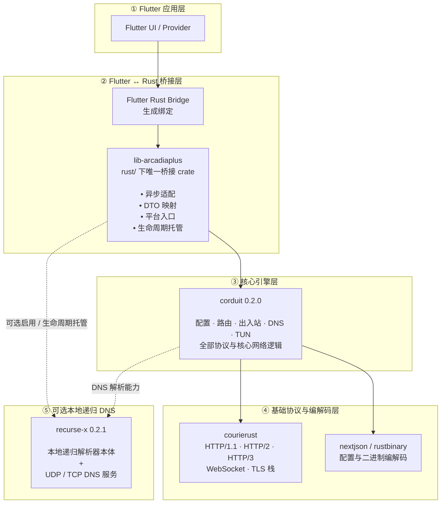

# ArcadiaPlus

<p align="center">
  
</p>

<p align="center">
  Flutter + Rust 跨平台代理客户端<br>
  <a href="README_EN.md">English</a>
</p>

## 当前实现

- Flutter Material Design 3 UI：明暗主题、动态颜色、Google Fonts、响应式导航和页面/组件动画。
- Rust 侧只留一层 FFI：代理引擎、DNS、TUN 数据路径与全部代理协议都由 [corduit](https://crates.io/crates/corduit) 0.2.0 提供，本仓库不再重复实现协议；桥接层负责同步/异步适配、DTO 映射与平台入口。
- 配置转换采用显式降级：corduit 无法构建的协议节点会被丢弃、引用回落 `DIRECT`，corduit 没有对应类型的规则会被跳过——每次降级都通过 `onWarning` 上报，不静默处理。
- 可选本地递归解析：开启后由 [RecurseX](https://crates.io/crates/recurse-x) 从根服务器迭代解析，corduit 的 DNS 上游指向该前端。
- 规则集（`rule-providers`）由 Dart 侧托管：`RuleProviderService` 下载、校验、规范化并缓存到应用私有目录，按 profile 声明的 `interval`（默认 86400 秒）自动刷新；交给引擎的一律是本地 `file` 规则集，刷新失败沿用上一次可用副本，规则集缺失时引用它的 `RULE-SET` 规则按 Clash 语义直接跳过并上报警告，不会拖垮整个配置。
- GeoIP 数据库随安装包分发（`assets/Country.mmdb`），启动时解包到应用支持目录并注册给引擎；解包或注册失败会记录原因，此时 `GEOIP` 规则不会被匹配——不静默降级。
- Android、Windows、Linux 共用 Rust TUN 数据包处理器，各平台独立管理设备生命周期。
- Windows、macOS、Linux、Android、iOS、HarmonyOS NEXT 的应用图标均由 `assets/arcadiaplus.png` 统一生成。

## 协议状态

协议实现位于 corduit 0.2.0；本仓库只负责把它们接进 Flutter，并未对真实服务端互操作做验证。

| 协议 | 实现来源 | 说明 |
| --- | --- | --- |
| HTTP / SOCKS5 | corduit | 出入站路径均在引擎内 |
| Shadowsocks | corduit | 含 AEAD 与流密码路径 |
| VMess / VLESS / Trojan | corduit | 含 WebSocket、gRPC、TLS 传输 |
| TUIC / Hysteria 2 | corduit（`tuic`、`hysteria2` feature） | QUIC 路径，本构建已启用 |
| WireGuard | corduit（`wireguard` feature） | 隧道路径，本构建已启用 |
| ShadowsocksR / Hysteria v1 / shadowquic | 不支持 | 桥接层在配置转换时丢弃该节点并回落引用，同时上报警告 |

协议进入“已支持”状态至少需要：官方/主流服务端互操作测试、TCP 与 UDP 测试、认证失败测试、断线重连测试，以及各目标平台上的集成测试。

## 平台状态

| 平台 | UI 壳 | 系统代理 | 全局 TUN/VPN | 当前结论 |
| --- | --- | --- | --- | --- |
| Android | 有 | 不适用 | `VpnService` 路径已实现 | 需要真机、ABI 和长连接回归测试 |
| Windows | 有 | 已实现 | Wintun 路径已实现 | 需要管理员权限和 Windows 10/11 实机测试 |
| Linux | 有 | GNOME 设置路径（逐条校验 `gsettings` 退出码） | corduit 提供 IPv4 TUN 路径 | 需 root/实机验证；数据面把默认路由指向 TUN 且只豁免代理服务器地址，rule/direct 模式下引擎直连的流量存在回到 TUN 的风险，验证前不宣称可用 |
| macOS | 有 | `networksetup` 路径 | 未实现 Network Extension | 不能宣称全局代理支持 |
| iOS | 有 | 不适用 | 未实现 Packet Tunnel Extension | 仅应用壳 |
| HarmonyOS NEXT | 有工程骨架 | 不适用 | 明确返回 `OHOS_VPN_UNSUPPORTED` | 不可发布 |

## 路由模式

`rule` / `global` / `direct` 的判定全部在引擎里完成：inbound、TUN 数据面与 Android VPN 都把连接交给同一个路由器，所以切换模式从不需要重建隧道。

| 平台 | 切换模式时做什么 | 说明 |
| --- | --- | --- |
| Android | `set_android_proxy_mode`（引擎运行时模式）+ 通知文案 | VPN 路由固定 `0.0.0.0/0`，模式由引擎在拨号时决定；进隧道的 53 端口查询统一由 netstack 的 fake-IP 解析器应答 |
| Windows | `set_windows_proxy_mode` | 切到 `global` 时若路由表还没进入全局模式，改用 `enable_tun_mode_with_mode("global")` 重建路由 |
| Linux / macOS | `set_proxy_mode`（引擎运行时模式） | Linux 的 TUN 数据面把连接转给本地 SOCKS inbound，模式在拨号时生效 |
| 系统代理 | 与模式无关 | 指向本地 mixed 端口；Linux 逐条校验 `gsettings` 退出码，Windows 启用前会快照原代理设置并在关闭时恢复 |

规则集刷新时机：应用启动、profile 更新，以及每 15 分钟一次的到期检查。只有声明间隔（默认一天）已过的规则集才真正发起网络请求，且带 `If-None-Match` / `If-Modified-Since` 条件头，304 视为已是最新；刷新后的文件按内容哈希命名，配置随之变化，运行中的引擎在下一次 `reload_corduit` 会立即装载新内容。

### 策略组语义

profile 里的 `proxy-groups` 是嵌套结构：一个 `select` 组的成员既可以是节点，也可以是另一个组，转发时引擎沿这条链逐层下钻（深度上限 10）。由此有两条必须知道的结论：

- **只有被规则引用的组才会决定出口。** 一个组如果没有任何规则指向它、也没有被别的组引用，改变它的选中项不会影响任何流量。典型机场配置会定义十几个组（流媒体、Steam、Cloudflare 等），其中绝大多数只服务特定规则。
- **组的默认成员是成员列表的第一个。** 在用户做出选择之前，引擎按 Clash 语义使用首成员，因此“首次连接走到了列表第一个节点”是配置的默认行为，不是选择丢失。应用把每个组的选择持久化，并在引擎就绪后重新下发全部组，切换 profile 时同样重新下发。

排查「出口与预期不符」时按此顺序确认：目标流量被哪条规则匹配 → 该规则的组 → 该组的选中成员 → 该成员是不是节点（也可能是嵌套组）。应用在每次下发选择后都会向引擎读回实际生效的成员，不一致时记录 `Selection mismatch` 并重试。

## 空闲开销

代理客户端绝大多数时间没有数据要传，因此空闲连接的代价直接决定设备功耗与整机响应。本项目对此有两条硬约束，均已落到代码并覆盖测试：

- **读操作不会在没有拿到数据的情况下反复重入。** 引擎的空闲等待建立在 `Notify` 闩锁上，而闩锁语义只回答“是否观察到通知”，无法区分“闩锁唤醒（根本没有阻塞）”与“超时”。`read_blocking` 因此使用 `wait_latched`，仅在“闩锁唤醒且接收缓冲仍为空”时退避 1 ms；携带数据的唤醒立即返回，超时路径不受影响。
- **没有数据就不占用唤醒。** `push_recv_data` 在接收缓冲已满、或载荷为空（纯 ACK、零窗口探测）时直接返回，不再置位唤醒闩锁；`close` 只在 open→closed 翻转时通知一次。

与之配套的是线程所有权：`relay_with` 在每一条出口路径上 join 自己启动的两个方向线程，且某一方向 panic 时先释放两侧再 join，因此它返回之后不会再留下持有传输与 socket 的活动线程。

- **错误码要按契约选，不能按语意描述选。** `std::io::Write::write_all` 对 `ErrorKind::Interrupted` 是**无限重试**（约定为“被信号打断，内容无问题”）。把“会话已取消”映射成 `Interrupted`，会让每一次帧写入失败都变成“分配一个错误字符串 → 立即重试 → 再失败”的死循环：循环体内没有任何系统调用可以阻塞，因此线程满核运行且 `wchan` 为空。取消现在映射到 `ConnectionAborted`（终态）。

上述三条在真机隧道开启状态下测得的前后对比（同一设备、同一订阅、同一时间窗口口径）：

| 观测量 | 修复前 | 修复后 |
| --- | --- | --- |
| 进程 `utime`（每 10 s） | 7.00 核 | **0.01 核** |
| 进程 `stime` | 0.05 核 | 0.01 核 |
| `procs_running` | 118 | **1** |
| `PSI cpu some avg10` | 78.58% | **5.68%** |
| `corduit-relay-up` / `-down` 线程数 | 136 / 41 | **8 / 8** |
| 处于运行态且 `wchan` 为空的线程 | 117 | **0** |
| 代理是否仍可用 | 是（出口 HK） | 是（出口 HK） |

### 在真机上验证

空转的特征是**用户态 CPU 高、系统调用近乎为零、I/O 不增长**三者同时出现。以下命令不需要 root：

```bash
# 1) 系统级 CPU 停顿（Pressure Stall Information）：持续偏高说明有进程在抢 CPU
adb shell cat /proc/pressure/cpu

# 2) 就绪队列长度：持续偏高就是用户感受到的“卡”
adb shell grep procs_running /proc/stat

# 3) 进程用户态/内核态时间，两次采样求差（单位：100 Hz 计时脉冲）
adb shell 'P=$(pidof com.blueokanna.arcadiaplus); awk "{print \$14, \$15}" /proc/$P/stat; sleep 15; awk "{print \$14, \$15}" /proc/$P/stat'

# 4) I/O 增量：与 3) 对照，若 CPU 增长而字节数不增长，即为空转
adb shell cat /proc/$(pidof com.blueokanna.arcadiaplus)/io

# 5) 线程级定位：wchan 为空（显示为 0）表示线程停留在用户态，未阻塞在任何系统调用上
adb shell 'P=$(pidof com.blueokanna.arcadiaplus); for t in /proc/$P/task/*; do echo "$(cat $t/comm) $(cat $t/wchan)"; done | sort | uniq -c | sort -rn'
```

判据：空闲隧道下 `procs_running` 应为个位数，运行中线程的 `wchan` 应为内核睡眠符号而非空。

## 已知限制

这些是需要知道的边界，避免把某个设置当成它并不具备的能力：

- App 能编辑的 DNS 面只有 DNS 设置页，且只在“覆盖 DNS”开启时生效——未开启时以 profile 的 `dns` 段为准。引擎更宽的 DNS 面（`nameserver-policy`、`fallback-filter`、`fake-ip-range` / `-filter` / `-ttl`、`cache-size`、`hosts`）由 profile 直接透传，没有对应的设置页。
- 系统代理的 bypass 列表：Windows（`ProxyOverride`）与 Linux（`ignore-hosts`）会下发，macOS 的 `networksetup` 路径暂时只在启用/关闭时设置代理本身。

## 架构


corduit 是同步引擎，Dart 侧接口保持 `Future`——桥接层把每个引擎调用派发到阻塞工作线程（`run`），因此代理启停、延迟探测或 TUN 切换都不会卡住 Flutter 隔离区。

保持边界清晰比无目的地增加宏、泛型或复杂生命周期更重要。Rust 代码只在能减少重复、表达所有权或实现零成本抽象时使用这些能力。

## 环境要求

- Flutter SDK（Dart `^3.12.0`；CI 使用 Flutter 3.47.2）
- Rust ≥ 1.88（edition 2021；`rust-toolchain.toml` 固定 1.97.0，本地与 CI 使用同一编译器跑 rustfmt/clippy）
- Android：Android SDK、NDK、JDK 17
- Windows：Visual Studio C++ 工具链；Wintun/管理员权限
- macOS/iOS：Xcode 与有效签名配置
- HarmonyOS NEXT：DevEco Studio、API 12 SDK、Flutter OHOS 工具链

## 构建与检查

```bash
flutter pub get
flutter analyze
flutter test

cd rust
cargo fmt --all -- --check
cargo clippy --workspace --all-targets -- -D warnings
cargo test --workspace
```

Dart 桥接代码由 `flutter_rust_bridge.yaml` 驱动生成；改动 Rust 侧 `api`/`types` 后必须重新执行：

```bash
flutter_rust_bridge_codegen generate
```

平台构建必须在对应宿主和 SDK 上执行：

```bash
flutter build apk --release
flutter build windows --release
flutter build linux --release
flutter build macos --release
flutter build ios --release --no-codesign
```

HarmonyOS NEXT 使用 [ohos/README.md](ohos/README.md) 中的 DevEco/hvigor 流程。构建成功只证明工具链可用，不等于 VPN 数据路径已通过验证。

`rust/Cargo.toml` 中的 corduit 依赖在本地开发时带有 `path`（指向同级目录 `../Corduit`）。CI 的 checkout 里没有该目录，因此提交前需要确认 CI 使用的是 crates.io 上的版本：去掉 `path`，或让 workflow 先 checkout 对应仓库。否则 CI 会在解析依赖阶段失败，而不是在编译阶段给出可读的错误。

## 图标

唯一源文件为 `assets/arcadiaplus.png`（正方形，至少 1024x1024）。Windows 环境执行：

```powershell
powershell -NoProfile -ExecutionPolicy Bypass -File scripts/generate_icons.ps1
```

脚本会生成 Android、iOS、macOS、Windows、Linux、Web 和 HarmonyOS 所需资源，并校验源图尺寸。不要手工编辑生成图标。

## 自动化验证

每次 push 和 pull request 都会执行 Dart 格式检查、Flutter 分析与测试、Android Debug APK 构建、Android Release lint（`./gradlew :app:lintRelease`，只 lint 本应用模块——不带前缀的 `lintRelease` 会连带仓库外的插件源码一起报错）、Rust 格式检查、将警告视为错误的 Clippy，以及 Rust 全工作区测试。发布工作流会先运行同一套质量门，全部通过后才发布。

自动构建通过不等于 VPN 行为或协议互操作已经得到证明。Android VPN 真实流量、Windows/Linux 特权 TUN 路由、Apple Network Extension、HarmonyOS VPN FD 处理，以及真实服务端协议兼容性，仍必须满足下方发布门槛。

## GitHub 发布配置

推送 `vMAJOR.MINOR.PATCH` 标签（或从默认分支手动触发发布工作流）后，工作流会先跑完整质量门，全部通过后自动构建并发布正式版本，无需人工确认。每个正式版本包含：

- `ArcadiaPlus-<tag>-android-debug.apk` —— 四 ABI Debug 构建，用于问题诊断。
- `ArcadiaPlus-<tag>-android-release.apk` —— 四 ABI 优化构建，用于安装使用。
- `ArcadiaPlus-<tag>-windows-x64-setup.exe` 与 `-windows-x64-portable.zip` —— Inno Setup 安装包与免安装压缩包。
- `ArcadiaPlus-<tag>-macos-universal.dmg` 与 `-macos-universal.zip` —— 通用架构（Apple 芯片 + Intel）磁盘映像与压缩包；应用未签名，首次启动需右键 → 打开。
- `ArcadiaPlus-<tag>-linux-x64.deb` 与 `-linux-x64.tar.gz` —— Debian 安装包与可携带压缩包。
- `update-manifest.json` 与 `SHA256SUMS` —— 应用内更新检查读取的校验和元数据。

只有配置了以下仓库 Actions Secrets 时，Android release APK 才会用发布密钥签名（`ARCADIAPLUS_KEYSTORE_BASE64` 是 keystore 文件的 base64 编码，如 `base64 -w0 arcadiaplus.jks`）：

- `ARCADIAPLUS_KEYSTORE_BASE64`
- `ARCADIAPLUS_KEYSTORE_PASSWORD`
- `ARCADIAPLUS_KEY_ALIAS`
- `ARCADIAPLUS_KEY_PASSWORD`

未配置时 release APK 回退到 debug 密钥签名：可以安装，但只能升级由 debug 密钥签名的安装——首次公开发布前必须配置好 keystore。

`pubspec.yaml` 中的 `version`、变更日志顶部版本和 `vMAJOR.MINOR.PATCH` 标签必须一致。手动发布只能从默认分支执行。已经发布的 Release 及其产物不可变，工作流会明确失败，不会静默覆盖或把既有产物当作本次成功。

## 发布门槛

在标记正式版本前必须完成：

1. 用成熟、经过审计的实现替换或验证 WireGuard、Hysteria 2、TUIC；补充 Hysteria v1 与 NaiveProxy。
2. 完成 Linux global 路由接管/恢复的隔离网络测试，并补齐无路由环路的 rule/direct、IPv6、DNS 防泄漏与网络切换恢复；实现 Apple Network Extension 和 HarmonyOS VPN FD 到 Rust 的完整生命周期。
3. 为每个协议建立容器化互操作测试矩阵，并在 CI 中覆盖 TCP、UDP、IPv4、IPv6、重连和错误认证。
4. 在六个平台完成签名发布构建、安装、启停、休眠恢复、网络切换和泄漏测试。

## 免责声明

- **合法使用是唯一被授权的用途。** ArcadiaPlus 是网络工具，本身不提供代理服务器、节点或订阅；你需要自行准备配置，并对其合法性负责。
- **合规责任在你自己。** 你需要确保使用行为符合所在司法管辖区的法律、所接入网络的条款，以及适用的出口管制与制裁规定。将本软件或其改动、衍生作品用于违法用途，不在许可范围内，并构成对[许可条款](LICENSE)的违反。
- **作者与贡献者不承担责任。** 在法律允许的最大范围内，作者与贡献者对因使用或无法使用本软件产生的任何直接或间接损失不负责，也不对任何人（无论是否经你授权）使用本软件从事违法行为引发的后果负责。
- **不构成法律意见。** 本文档与应用内提示只是风险说明，不是法律建议；需要时请咨询执业律师。
- **无担保。** 软件按「现状」提供，不附带任何明示或默示保证（见 `LICENSE` 的 *No Liability* 一节）。

## 许可证

**PolyForm Perimeter License 1.0.1**——见 [`LICENSE`](LICENSE)：正文是官方 [PolyForm Perimeter
1.0.1](https://polyformproject.org/licenses/perimeter/1.0.1)，末尾多出一段由许可人自己增加的附加条款。

实际含义：

- **可免费用于除「竞争产品」之外的任何目的。** 阅读、构建、修改、自托管、内嵌进公司内部或客户系统、教学使用、随非竞争软件分发：都允许。不允许的是向他人提供替代本软件功能或价值的产品——包括以服务接口形式提供，也包括移植到其它语言（见
  [Noncompete](https://polyformproject.org/licenses/perimeter/1.0.1/#noncompete) 与
  [Competition](https://polyformproject.org/licenses/perimeter/1.0.1/#competition)）。
- **不是 OSI 认可的开源许可**，而是 *source-available（源码可获取）* 许可：源码可以按上面的条款阅读和修改，而且你转发出去的副本，接收方也同时得到这份条款。
- **必须保留署名通知。** 分发本软件或其任何部分时，必须随附 `LICENSE` 全文（或上述官方链接），以及其中的 `Required Notice: Copyright 2026 blueokanna and HyphenTeam (https://github.com/blueokanna/Courierust)`（见 *Notices*）。
- **无担保、无责任**（在法律允许范围内），并且末尾那段附加条款把同样的限制延伸到「他人用本软件（或其改动/衍生作品）从事违法行为」的情形（见 `LICENSE` 末尾 *Additional Term Adopted by the Licensor*）。
