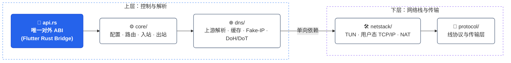

# VeloGuard

<p align="center">
  
</p>

<p align="center">
  Flutter + Rust 跨平台代理客户端<br>
  <a href="README_EN.md">English</a>
</p>


## 这个项目是做什么

一个把 TUN 接管、协议出站、DNS 策略和 Flutter UI 缝在一起的桌面/移动代理客户端。
Rust 侧只暴露 `crate::api`，UI 永远不碰内部类型；内部各层只向下依赖，不反向调用 UI。

配置解析是**失败关闭**的：未知入站/出站/规则类型、空 payload、非法域名、编译不过的正则，
都会在加载阶段直接拒绝，不存在“看不懂就当作 DIRECT 直连”的兜底路径。

## 基本框架


## 自有 crate 栈

| crate | 版本 | 在本仓库承担什么 |
| --- | --- | --- |
| `corduit` | 0.1.4 | 引擎底座。除 `dns::bogon`（CIDR 表与判定不再保留第二份）外，**全部密码学原语**（哈希、HMAC、HKDF、AES-GCM、ChaCha20-Poly1305、X25519、base64/hex、ChaCha20 CSPRNG）与 URL 解析（`common::url`）也来自它 |
| `rustbinary` | 0.1.8（经 `corduit` 传递） | **未直接使用**：0.1.8 的 legacy profile 输出带字段名与类型标签的编码，已经不是 TUIC v5 握手需要的字节布局。该包改由 `protocol/tuic` 自己编码，并有单测冻结字节 |
| `nextjson` + `nextjson-derive` | 0.1.4 | Dart 侧配置 JSON 的解析入口（`initialize_veloguard` / `reload_config` / 规则提供者）与对应 DTO 派生 |
| `tzcraft` | 0.1.2 | 日志时间戳：系统时区 → 民用时间 |
| `recurse-x` | 0.1.0 | 域名语法校验，喂给配置校验器的 fail-closed 检查 |
| `courierust` | 1.0.4 | HTTP/HTTPS/TLS 出口：订阅、规则列表、更新包下载、延迟探测全部走它（`crate::http`），自带连接池、HTTP/2 与 TLS 1.2/1.3；gRPC/服务端面（入站 CONNECT、DoH server、h2、ws）仍在迁移 |

密码学只有一条路径：

- `crate::crypto` 是唯一入口，内部全部来自 `corduit::crypto`。清单里**没有** `sha2`、`aes-gcm`、`chacha20poly1305`、`hkdf`、`blake2`、`blake3`、`x25519-dalek`、`md-5`、`sha1`、`base64`、`rand`、`reqwest`——
  同一原语有两份实现，就有两个地方能藏 bug。
- 唯一例外是操作系统熵源（`getrandom`）：它是系统调用包装，不是密码学实现；内核 CSPRNG 是信任根，不可能在用户态重写。
  进程级 CSPRNG（ChaCha20 keystream + OS 种子、每 64 KiB 重新播种）负责 DNS 事务 ID、VMess 掩码/填充、
  WireGuard 源端口、TCP ISS 这类“可预测就会出事”的随机数。
- 协议字节仍然住在协议文件里：WireGuard 的 `mac1`（键控 BLAKE2s-128）、SS2022 的子密钥派生、TUIC 鉴权包都有单测把字节钉死。
- Dart 侧的情况写清楚：Rust 侧已经完全走自有栈，但把订阅/哈希也接到 Rust 的三接口（`fetchSubscription` / `fetchText` /
  `sha256FileHex`）已实现又被撞下——FRB 2.12.0 对当前 crate 生成的 Dart 绑定本身是坏的（详见下节），
  因此这两个能力暂时仍由 Dart 的 `http` / `crypto` 承担。升级 FRB 后即可切过去，删除这两个包。
- **FRB 代码生成有上游阻塞：** 本机 codegen 与 Dart 包都是 2.12.0，对合并后的 crate 跑 `generate` 会输出带语法错误的
  `frb_generated.io.dart`（缺失函数头的 `$allocator<WireSyncRust2DartSse>` 片段）。现状是「重生成 Rust 胶水 +
  回滚 Dart 绑定」；因此不要盲目重跑 codegen，升级 FRB 前先确认输出可通过 `flutter analyze`。

两点值得写在明面上：

- `corduit` 精确锁定了 `tun-rs = 2.5.7`，所以本仓库也钉在同一版本——`tun-rs` 的 2.x 是同一条 semver 线，
  两个版本没法共存，resolver 会直接拒绝。
- `rustbinary` 的编解码 trait 由 `nextjson` 提供（`NsonSerialize` / `NsonDeserialize`），
  升级会改 trait 约束；实测发现 0.1.8 的「legacy」输出已经不再是旧字节布局，
  所以 TUIC 鉴权包收回本仓库自己编码，并用单测把 `version || uuid || token` 的字节序列钉死。
  这正是那支单测存在的意义：升级依赖时先把协议字节拦住。
- `courierust` 的客户端是**同步**的（它自己拥有线程与连接池），因此 `crate::http` 在
  `spawn_blocking` 里跑它，并对 `tokio` worker 保持 async 外观；客户端的 TLS 根证书来自平台信任库，
  也可以用 `VELOGUARD_TRUST_ROOTS_PEM` 指向额外 PEM 包，服务端面还没迁完的部分在清单里依然标注 hyper 系依赖。

## 协议状态

| 协议 | 当前状态 | 说明 |
| --- | --- | --- |
| HTTP / SOCKS5 | 已实现 | TCP 出站；仍需发布环境端到端测试 |
| Shadowsocks | 实验性 | 自研 TCP/UDP 加密路径和单元测试；未提供真实服务端互操作证据 |
| VMess | 实验性 | 自研协议与传输层；未提供 Xray 互操作测试 |
| VLESS | 实验性 | 自研 TCP/UDP/TLS 路径；未提供 Xray 互操作测试 |
| Trojan | 实验性 | 自研 TCP/UDP/TLS 路径；未提供标准服务端互操作测试 |
| WireGuard | 不可用于生产 | 握手/加密和 UDP 路径存在；TCP 路径缺少完整 TCP/IP 状态机、重传和拥塞控制 |
| TUIC v5 | 实验性 | 基于 Quinn 的实现；缺少真实 TUIC 服务端兼容性测试 |
| Hysteria 2 | 不可用于生产 | 当前自定义 QUIC 鉴权/帧格式未证明符合 Hysteria 2 标准 |
| Hysteria v1 | 未实现 | 不再错误映射为 Hysteria 2；配置会明确失败 |
| NaiveProxy | 未实现 | 配置会明确失败，不会绕过代理直连 |

进入“已支持”至少需要：官方/主流服务端互操作测试、TCP 与 UDP 测试、认证失败测试、断线重连测试，
以及各目标平台上的集成测试。上面每一行的“实验性”，都是字面意思。

## 平台状态

| 平台 | UI 壳 | 系统代理 | 全局 TUN/VPN | 当前结论 |
| --- | --- | --- | --- | --- |
| Android | 有 | 不适用 | `VpnService` 路径已实现 | 需要真机、ABI 和长连接回归测试 |
| Windows | 有 | 已实现 | Wintun 路径已实现 | 需要管理员权限和 Windows 10/11 实机测试 |
| Linux | 有 | GNOME 设置路径 | 已实现仅 IPv4 的 global 模式路径 | 仍需 root/实机验证；在完成 socket mark 或物理网卡绑定前，rule/direct 模式会主动拒绝 |
| macOS | 有 | `networksetup` 路径 | 未实现 Network Extension | 不能宣称全局代理支持 |
| iOS | 有 | 不适用 | 未实现 Packet Tunnel Extension | 仅应用壳 |
| HarmonyOS NEXT | 有工程骨架 | 不适用 | 明确返回 `OHOS_VPN_UNSUPPORTED` | 不可发布 |

## 安全设计

- **手写代码没有裸 `unsafe` 数据面**：`unsafe` 只出现在平台 FFI 边界（TUN / Wintun / JNI / 进程枚举），
  其余出现都在 FRB 生成代码里。
- **Wintun 下载不再默认发生**：运行期下载 DLL 需要 `VELOGUARD_ALLOW_WINTUN_DOWNLOAD=1`，
  且用 `VELOGUARD_WINTUN_SHA256=<hex>` 固定“解包后 DLL”的 SHA-256；哈希不符时磁盘一个字节都不会写。
  安装走临时文件 + rename，下载体积有硬上限。校验不过就请用户去官方装 Wintun。
- **失败关闭**：非法域名规则、编译不过的正则、未知协议类型在配置加载期就报错，
  不会等到流量已经在路上才“静默回落”。
- **默认无遥测。** 不开 `jaeger` feature 就没有任何上报代码参与构建；打开后才会向你自己配置的 OTLP 端点发链路数据。日志默认只留在本地与 UI 缓冲区。
- **非审计软件**：这是一份工程代码，不是经过第三方审计的密码学产品。发现漏洞请走私有渠道，
  不要先开 public issue。

## 环境要求

- Flutter SDK 对应 Dart `^3.10.4`
- Rust stable **≥ 1.88**，`edition = 2024`
- Android：Android SDK、NDK、JDK 17
- Windows：Visual Studio C++ 工具链；Wintun/管理员权限
- macOS/iOS：Xcode 与有效签名配置
- HarmonyOS NEXT：DevEco Studio、API 12 SDK、Flutter OHOS 工具链

## 构建与检查

```bash
flutter pub get
flutter analyze
flutter test

cd rust
cargo check --all-targets
cargo test
cargo clippy --all-targets
cargo fmt --check
```

平台构建必须在对应宿主和 SDK 上执行：

```bash
flutter build apk --release
flutter build windows --release
flutter build linux --release
flutter build macos --release
flutter build ios --release --no-codesign
```

HarmonyOS NEXT 使用 [ohos/README.md](ohos/README.md) 中的 DevEco/hvigor 流程。
构建成功只证明工具链可用，不等于 VPN 数据路径已通过验证。

## 图标

唯一源文件为 `assets/veloguard.png`（正方形，至少 1024x1024）。Windows 环境执行：

```powershell
.\scripts\generate_icons.ps1
```

## 许可证

[PolyForm Perimeter License 1.0.0](LICENSE)：允许阅读、修改、分发、内部与商业使用，
但**不允许把它做成与任何软件竞争的替代品**（Noncompete）。完整条款以 `LICENSE` 为准。

---

## 免责声明

**使用本软件即表示你已阅读、理解并接受以下全部内容；不同意请立即停止使用并删除全部副本。**

1. **无担保。** 本软件按“现状（AS IS）”提供，不附带任何明示或默示担保，包括但不限于
   可商用性、特定用途适用性、不侵权、以及不间断或无错误运行。
2. **网络风险自负。** 网络代理、隧道、TUN 接管、DNS 重写与流量劫持能力都有真实副作用。
   你需要在**你自己的设备、你自己的网络、你自己有权管理的环境**里使用它。
3. **法律责任。** 你需要自行确认并**遵守所在国家/地区的法律与法规**（**出口管制**、**制裁**、
   **电信与网络安全相关规定**），以及你所访问服务的条款。请勿将其用于未经授权的访问、
   攻击行为、规避合法监管或任何违法用途！
4. **责任限制。** 在适用法律允许的最大范围内，作者与贡献者不对任何直接、间接、附带、
   特殊、惩罚性或后果性损失负责，包括但不限于数据丢失、设备损坏、业务中断、利润损失、
   行政处罚或任何法律后果。
5. **协议实现状态。** 见上方“协议状态”。标注“实验性/不可用于生产”的实现没有完成
   与官方或主流服务端的互操作验证；请勿把它们放进任何关键链路。
6. **上游变化。** 上游协议、服务端实现与依赖库的行为可能随时变化并导致连接失败、
   指纹特征改变或性能回退，本项目不承诺跟进或兼容。
7. **无隶属关系。** 本项目与上述任何协议、组织或商业服务均无隶属、赞助或背书关系；
   相关名称与商标归各自权利人所有。
8. **非审计软件。** 本项目未经第三方安全审计，不构成任何安全保证。请自行评估风险，
   并在生产环境前做充分测试。
9. **分发限制。** 本仓库不包含、不托管、不推荐任何服务器、订阅或节点。分发本软件时，
   你必须一并保留 `LICENSE` 与免责声明，并遵守 PolyForm Perimeter 的非竞争条款。
